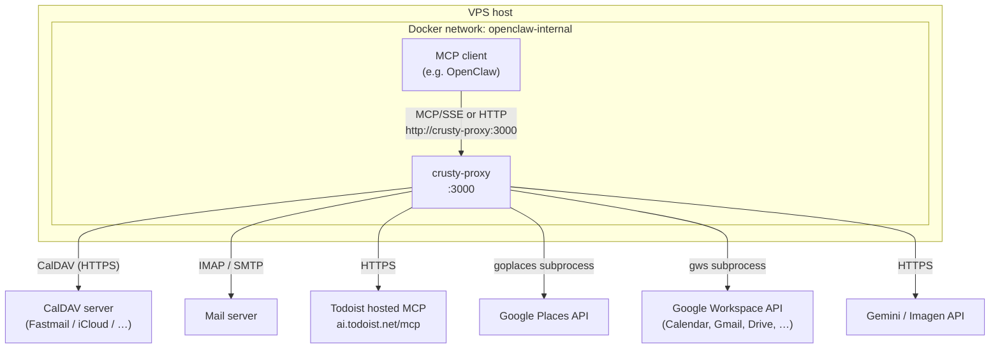
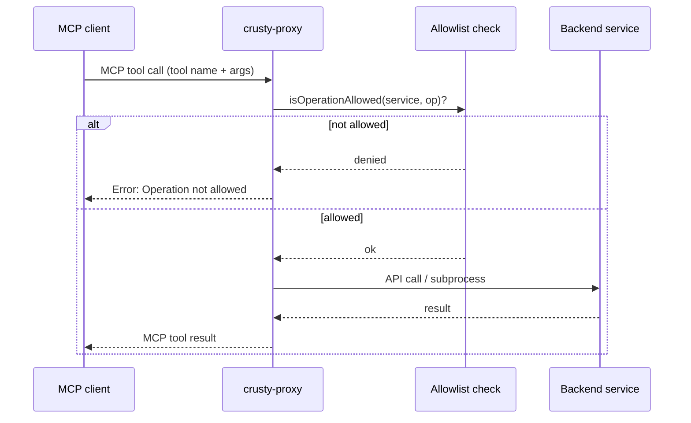
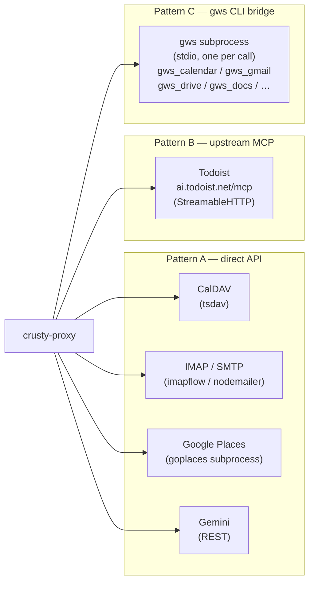
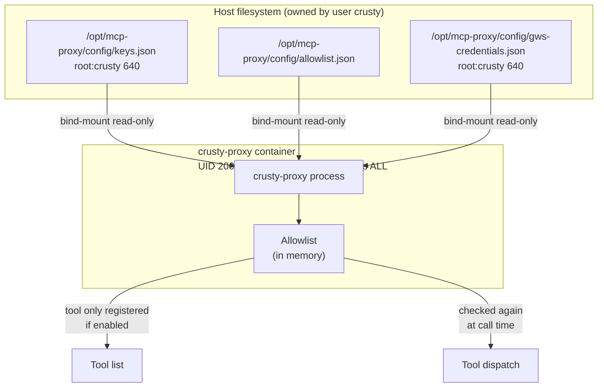
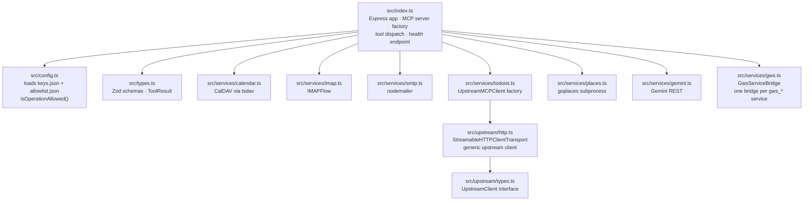

# crusty-proxy — Architecture

## System overview

The MCP client (an AI agent such as OpenClaw, or any other MCP-speaking workload) never touches external APIs or credentials directly. crusty-proxy is the only egress point.

---

## Request flow

The allowlist is checked twice: once when building the tool list (tool won't appear if disabled), and again at call time.

---

## Integration patterns

Three different patterns are used depending on the service:

| Pattern | How it works | Services |
|---------|-------------|----------|
| A — direct API | In-process TypeScript, credentials from `keys.json` | CalDAV, IMAP/SMTP, Places, Gemini |
| B — upstream MCP | Proxy forwards tool call to official hosted MCP server | Todoist |
| C — gws CLI bridge | Spawns a short-lived `gws` subprocess per call, credentials from bind-mounted file | All Google Workspace services |

---

## Security model

What this enforces:
- **The MCP client has no credentials** — it can only call tools the proxy exposes
- **The proxy cannot modify its own config** — bind-mounts are read-only
- **Deleted operations stay gone** — allowlist is re-read at startup, not cached per-call

What this does *not* prevent: a compromised client using the tools that are permitted (sending email, creating events, etc.).

---

## Source layout

---

## Transport endpoints

| Endpoint | Protocol | Used by |
|----------|----------|---------|
| `GET /sse` | MCP over SSE (legacy) | OpenClaw default |
| `POST /messages` | SSE message channel | OpenClaw default |
| `POST /mcp` | MCP Streamable HTTP | mcporter, modern clients |
| `GET /health` | JSON status | Docker healthcheck |
| `GET /health?check` | JSON + upstream pings | Manual verification |
